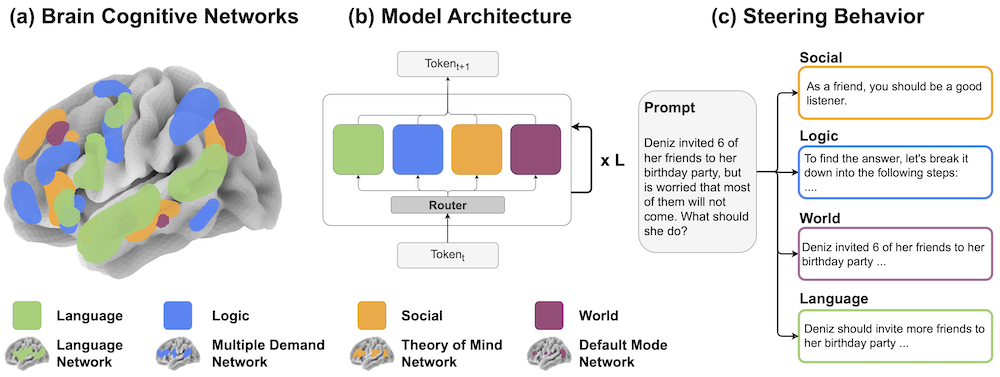
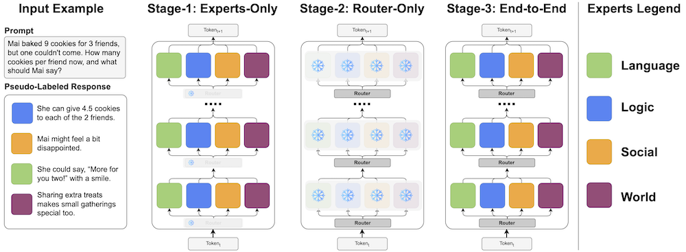

# Mixture of Cognitive Reasoners: Modular Reasoning with Brain-Like Specialization


<p>
  <a href="https://arxiv.org/abs/2506.13331">
    
  </a> |
  <a href="https://huggingface.co/collections/bkhmsi/mixture-of-cognitive-reasoners-684709a0f9cdd7fa180f6678">
    
  </a> |
  [
    <a href="https://bkhmsi.github.io/mixture-of-cog-reasoners/">
        Project Page
    </a>
  ]
</p>


<div style="text-align: center">
    
</div>

## Abstract
> Human intelligence emerges from the interaction of specialized brain networks, each dedicated to distinct cognitive functions such as language processing, logical reasoning, social understanding, and memory retrieval. Inspired by this biological observation, we introduce the Mixture of Cognitive Reasoners (MiCRo) architecture and training paradigm: a modular transformer-based language model with a training curriculum that encourages the emergence of functional specialization among different modules. Inspired by studies in neuroscience, we partition the layers of a pretrained transformer model into four expert modules, each corresponding to a well-studied cognitive brain network. Our Brain-Like model has three key benefits over the state of the art: First, the specialized experts are highly interpretable and functionally critical, where removing a module significantly impairs performance on domain-relevant benchmarks. Second, our model outperforms comparable baselines that lack specialization on seven reasoning benchmarks. And third, the model’s behavior can be steered at inference time by selectively emphasizing certain expert modules (e.g., favoring social over logical reasoning), enabling fine-grained control over the style of its response. Our findings suggest that biologically inspired inductive biases involved in human cognition lead to significant modeling gains in interpretability, performance, and controllability.

## Usage

### Training
<div style="text-align: center">
    
</div>

You can start the three-stage training process as follows:
```bash
python main.py -c config_micro_llama.py
```

### Generating Continuations

You can generate a continuation for a given prompt using the command below. Optionally, you can ablate specific experts by listing them in CSV format. 
```bash
python generate.py -c <config> --prompt <prompt> --ablate <expert>
```

* `<config>`: Path to one of the configuration files in the `configs` directory (e.g., `config_micro_llama.yml`).
* `<prompt>`: Any input string you want the model to continue.
* `<experts>` (optional): A comma-separated list of experts to ablate. The experts are: {`language`, `logic`, `social`, and `world`}.


## Repository Structure
```
├── configs/                  # Directory for configuration files
│   └── ...                   # Various config files for main.py and generate.py
├── data_utils/               # Directory for data handling utilities
│   ├── data_collator.py      # Script to format data for training
│   └── datasets.py           # Defines datasets used in training
├── generations/              # Directory for data used in stage-1 and stage-2 training
│   └── ...
├── models/                   # Directory for model implementations
│   ├── micro_llama.py        # Code for the MicroLlama model
│   └── micro_olmo.py         # Code for the MicroOLMo model
├── main.py                   # Main script to start the three-stage training process
├── train.py                  # Training script called by main.py for each stage
└── generate.py               # Script to generate text using a trained model, with ablation options
```

## BibTeX Citation 
```bibtex
@article{alkhamissi2025mixturecognitivereasoners,
    title={Mixture of Cognitive Reasoners: Modular Reasoning with Brain-Like Specialization}, 
    author={Badr AlKhamissi and C. Nicolò De Sabbata and Zeming Chen and Martin Schrimpf and Antoine Bosselut},
    year={2025},
    eprint={2506.13331},
    archivePrefix={arXiv},
    primaryClass={cs.LG},
    url={https://arxiv.org/abs/2506.13331}, 
 }
      
```