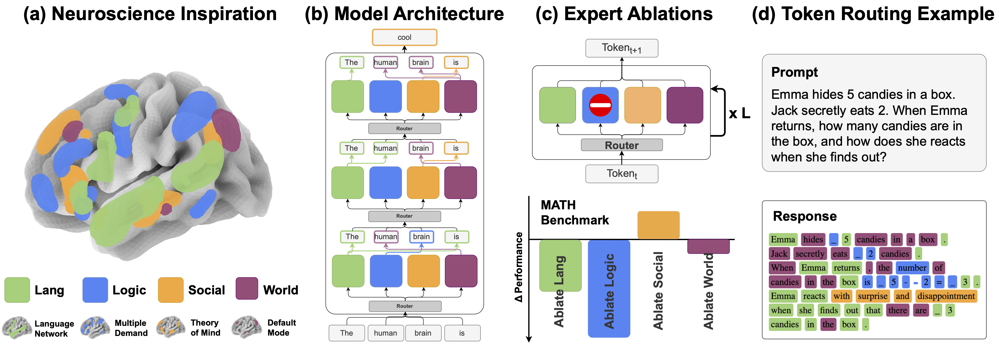
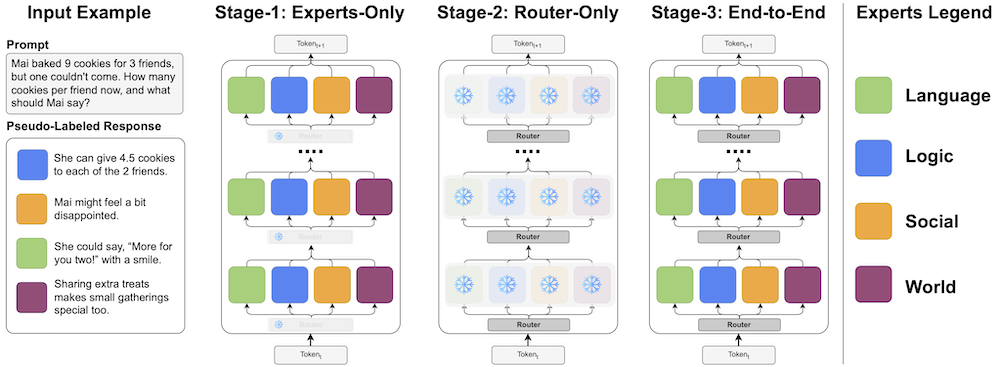

# Mixture of Cognitive Reasoners: Modular Reasoning with Brain-Like Specialization

Project Page: https://cognitive-reasoners.epfl.ch

[](https://arxiv.org/abs/2506.13331)
[](https://cognitive-reasoners.epfl.ch)
[](https://huggingface.co/collections/bkhmsi/mixture-of-cognitive-reasoners-684709a0f9cdd7fa180f6678)
[](https://huggingface.co/spaces/bkhmsi/cognitive-reasoners)
[](https://openreview.net/forum?id=m3jztlHDmG)


<div style="text-align: center">
    
</div>

## Abstract
> Human cognitive behavior arises from the interaction of specialized brain networks dedicated to distinct functions, such as language, logic, and social reasoning. Inspired by this organization, we propose Mixture of Cognitive Reasoners (MiCRo): a modular, transformer-based architecture post-trained with a curriculum that induces functional specialization across experts. Concretely, we partition the layers of a pretrained language model into four expert modules aligned with well-studied cognitive networks in the human brain. MiCRo offers three key advantages over standard language models. (1) The specialized experts are interpretable and causally meaningful -- ablating a module causes substantial drops on benchmarks requiring its specialized domain. (2) MiCRo's behavior can be dynamically steered at inference time by routing tokens to particular experts (e.g., favoring social over logical reasoning), enabling fine-grained control over outputs. (3) MiCRo outperforms or matches comparable baselines on both machine-learning reasoning benchmarks (e.g., GSM8K, BBH) and alignment to human behavior (CogBench), while maintaining interpretability. Taken together, cognitively grounded functional specialization yields models that are both more human-like and more human-interpretable.

## Usage

### Training
<div style="text-align: center">
    
</div>

You can start the three-stage training process as follows:
```bash
python main.py -c config_micro_llama.yml
```

### Generating Continuations

You can generate a continuation for a given prompt using the command below. Optionally, you can ablate specific experts by listing them in CSV format. 
```bash
python generate.py -c <config> --prompt <prompt> --ablate <expert>
```

* `<config>`: Path to one of the configuration files in the `configs` directory (e.g., `config_micro_llama.yml`).
* `<prompt>`: Any input string you want the model to continue.
* `<experts>` (optional): A comma-separated list of experts to ablate. The experts are: {`language`, `logic`, `social`, and `world`}.


## Repository Structure
```
├── configs/                  # Directory for configuration files
│   └── ...                   # Various config files for main.py and generate.py
├── data_utils/               # Directory for data handling utilities
│   ├── data_collator.py      # Script to format data for training
│   └── datasets.py           # Defines datasets used in training
├── generations/              # Directory for data used in stage-1 and stage-2 training and token routing prompts
│   └── ...
├── plots/                    # Directory for scripts used to generate paper plots
│   └── ...
├── models/                   # Directory for model implementations
│   ├── micro_llama.py        # Code for the MicroLlama model (same architecture used for SmolLM2)
│   ├── micro_moe_llama.py    # Code for the MicroMoELlama model (same architecture used for SmolLM2)
│   ├── micro_olmo.py         # Code for the MicroOLMo model
│   └── ...                   # Other modeling files
├── main.py                   # Main script to start the three-stage training process
├── train_sft.py              # SFT training script called by main.py for each stage
├── train_dpo.py              # DPO training script called by main.py
└── generate.py               # Script to generate text using a trained model, with ablation options
```

## BibTeX Citation 
```bibtex
@article{alkhamissi2025mixturecognitivereasoners,
    title={Mixture of Cognitive Reasoners: Modular Reasoning with Brain-Like Specialization}, 
    author={Badr AlKhamissi and C. Nicolò De Sabbata and Greta Tuckute and Zeming Chen and Martin Schrimpf and Antoine Bosselut},
    year={2025},
    eprint={2506.13331},
    archivePrefix={arXiv},
    primaryClass={cs.LG},
    url={https://arxiv.org/abs/2506.13331}, 
 }
      
```
